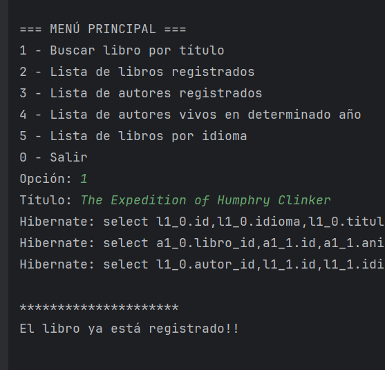
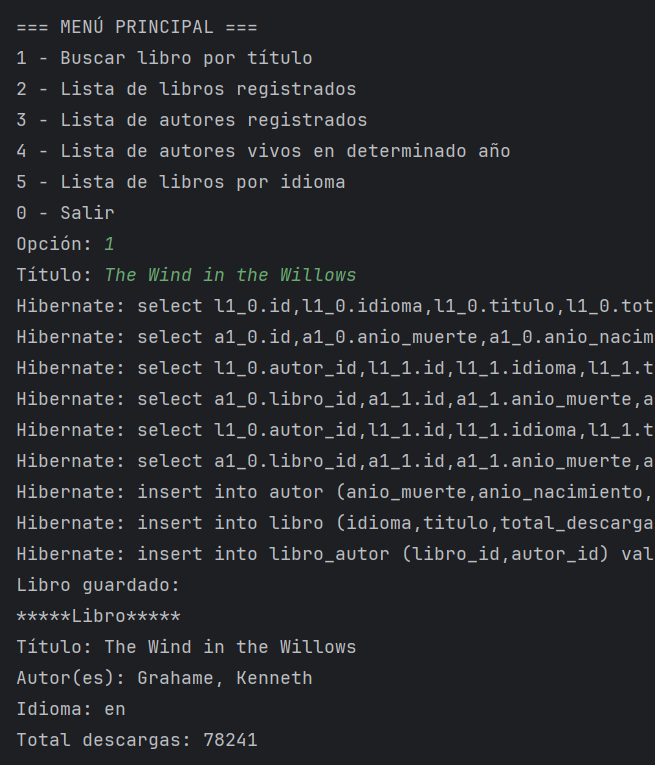
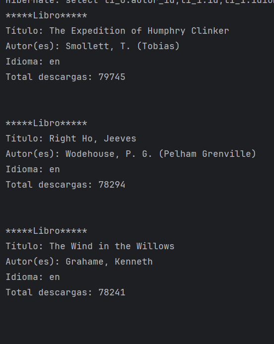
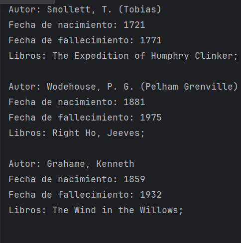
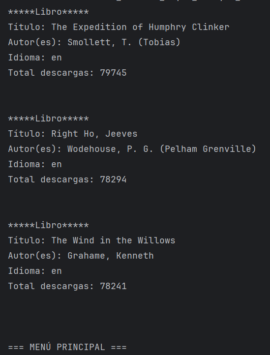
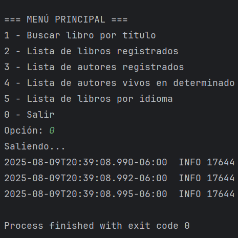

# Desafío Literatura

Proyecto para manejar libros y autores con diferentes funcionalidades.

---

## Menú principal en consola
=== MENÚ PRINCIPAL ===
1 - Buscar libro por título
2 - Lista de libros registrados
3 - Lista de autores registrados
4 - Lista de autores vivos en determinado año
5 - Lista de libros por idioma
0 - Salir

## Menú principal funcionamiento 

=== MENÚ PRINCIPAL ===  
1 - Buscar libro por título  
  

2 - Lista de libros registrados  
  
 

3 - Lista de autores registrados  
 
  

4 - Lista de autores vivos en determinado año  
  

5 - Lista de libros por idioma  
  
 

0 - Salir
 

## Descripción de funcionalidades

1. **Buscar libro por título**  
Busca un libro por su título usando una API externa y guarda la información si no existe.

2. **Lista de libros registrados**  
Muestra todos los libros guardados en la base de datos.

3. **Lista de autores registrados**  
Muestra todos los autores registrados con sus libros.

4. **Lista de autores vivos en determinado año**  
Filtra y muestra los autores que estaban vivos en un año dado.

5. **Lista de libros por idioma**  
Muestra los libros registrados filtrados por idioma.

---

## Cómo ejecutar

1. Clona el repositorio.  
2. Compila y corre la aplicación.  
3. Usa el menú para navegar y probar las opciones.

## Tecnologías y Herramientas Usadas
-Java 17
Lenguaje principal para el desarrollo del backend.

-Spring Boot
Framework para construir la aplicación web y gestionar la lógica del negocio, persistencia y servicios REST.

-Spring Data JPA
Para la interacción con la base de datos mediante repositorios y manejo ORM (Hibernate).

-Base de Datos H2 (en memoria) o PostgreSQL (según configuración)
Para almacenamiento de datos de libros y autores.

-API externa de literatura (Open Library API)
Se consume una API pública para obtener información sobre libros y autores al buscar por título.

-Postman
Herramienta para probar y validar las peticiones HTTP y consumo de APIs durante el desarrollo.

-Maven
Sistema de gestión y automatización de compilación.

-IDE IntelliJ IDEA
Entorno de desarrollo utilizado para escribir, depurar y ejecutar el código.

-Git y GitHub
Control de versiones y repositorio remoto para alojar el código del proyecto.

*Este proyecto fue desarrollado por Alan Sandoval.*

