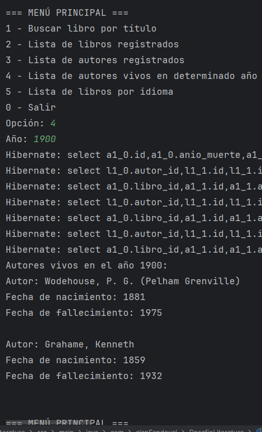

# Desafío Literatura

Proyecto para manejar libros y autores con diferentes funcionalidades.

---

## Menú principal

=== MENÚ PRINCIPAL ===  
1 - Buscar libro por título  
  
2 - Lista de libros registrados  
  
3 - Lista de autores registrados  
  
4 - Lista de autores vivos en determinado año  
  
5 - Lista de libros por idioma  
  

0 - Salir

---

## Descripción de funcionalidades

1. **Buscar libro por título**  
Busca un libro por su título usando una API externa y guarda la información si no existe.

2. **Lista de libros registrados**  
Muestra todos los libros guardados en la base de datos.

3. **Lista de autores registrados**  
Muestra todos los autores registrados con sus libros.

4. **Lista de autores vivos en determinado año**  
Filtra y muestra los autores que estaban vivos en un año dado.

5. **Lista de libros por idioma**  
Muestra los libros registrados filtrados por idioma.

---

## Cómo ejecutar

1. Clona el repositorio.  
2. Compila y corre la aplicación.  
3. Usa el menú para navegar y probar las opciones.

---

## Imágenes de cada menú

  
  
  
  
  

---

*Este proyecto fue desarrollado por Alan Sandoval.*

